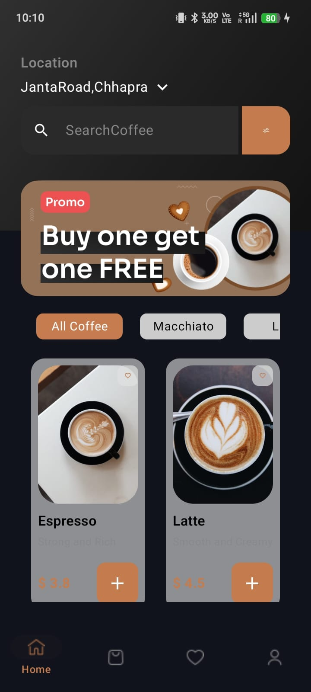
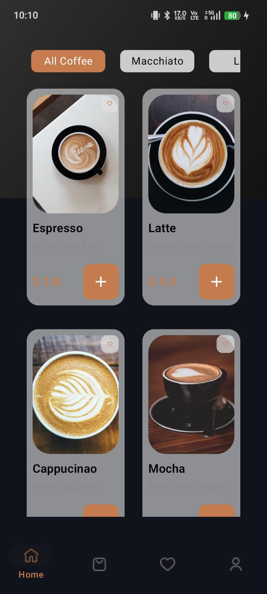
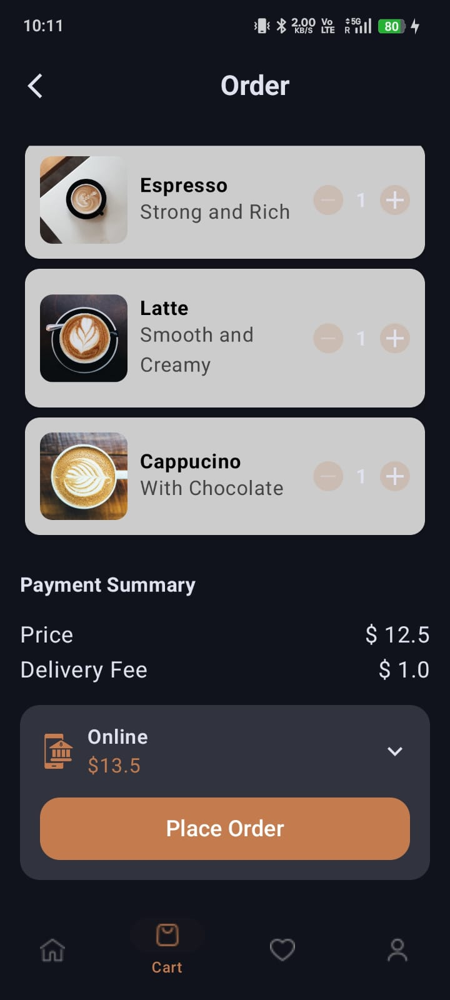
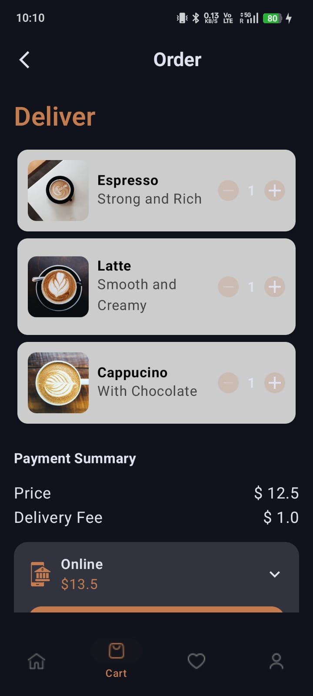
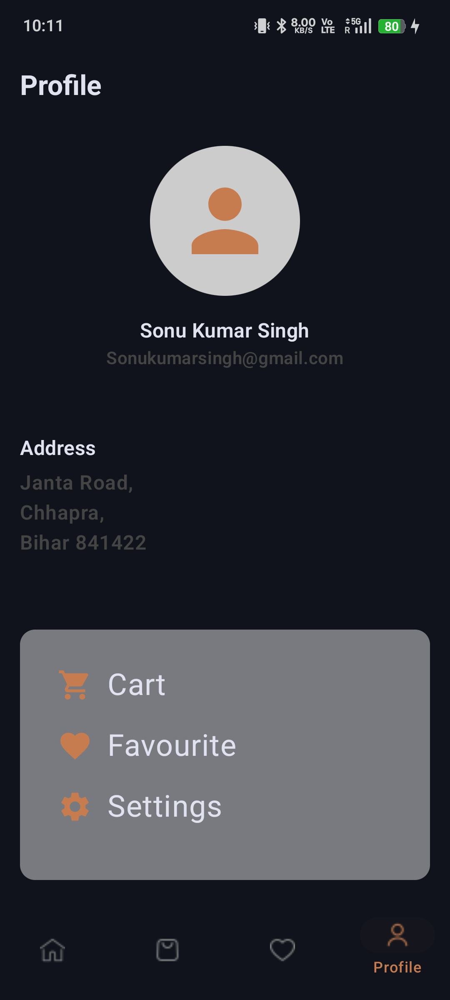

# ☕ My Coffee Application..

A modern Coffee Ordering Android Application built using **Jetpack Compose** and **Kotlin**.  
This app provides a smooth coffee browsing and ordering experience with clean UI and multiple screens.

---

## 📱 Features

- Home Screen with coffee categories
- Search Coffee functionality
- Promo Banner
- Coffee product listing
- Product Details Screen
- Add to Cart Screen
- Order Summary Screen
- Payment Mode Selection
- Favorite Screen
- Profile Screen
- Bottom Navigation Bar

---

## 🛠 Tech Stack

- Kotlin
- Jetpack Compose
- Material 3
- Navigation Compose
- State Management
- LazyColumn / LazyRow

---

## 📸 Screenshots

### Home Screen


### Product List


### Add To Cart


### Order Screen


### Profile Screen


---

## 📂 Project Structure

```bash
presentation/
│── navigation/
│── screens/
│   ├── homescreen
│   ├── detailsscreen
│   ├── cartscreen
│   ├── favouritescreen
│   ├── profilescreen
│── uicomponents/

domain/
│── model/

ui/
│── theme/
```

---

## 🚀 Getting Started

1. Clone repository

```bash
git clone https://github.com/your-username/MyCoffeeApplication.git
```

2. Open in Android Studio

3. Sync Gradle

4. Run on Emulator or Physical Device

---

## 🎯 Future Improvements

- Firebase Authentication
- Room Database
- Dark/Light Theme toggle
- Real Payment Gateway
- API Integration

---

## 👨‍💻 Developer

**Sonu Kumar Singh**

- Android Developer
- Kotlin & Jetpack Compose Enthusiast

---

## ⭐ Show your support

Give a ⭐ if you like this project.
